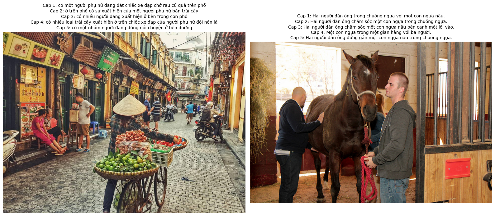

# Mô tả ảnh bằng ngôn ngữ tự nhiên

Bài tập lớn môn Một số vấn đề chọn lọc về Thị giác máy tính (MAT3563), kỳ 1 năm học 2025 - 2026 tại trường Đại học Khoa
học Tự nhiên, Đại học Quốc gia Hà Nội

## Giới Thiệu Chung

Dự án này tập trung nghiên cứu và triển khai các mô hình Mô tả hình ảnh bằng ngôn ngữ tự nhiên (Image captioning) –
nhiệm vụ kết hợp giữa Thị giác máy tính (Computer Vision) và Xử lý ngôn ngữ tự nhiên (Natural Language Processing). Mục
tiêu là xây dựng hệ thống có khả năng tự động sinh ra một câu mô tả tự nhiên và chính xác cho bất kỳ hình ảnh đầu vào
nào.

Chúng tôi đã triển khai và so sánh các kiến trúc tiên tiến để giải quyết bài toán này:

1. **Model 1: Encoder - Decoder:** Kiến trúc nền tảng sử dụng CNN để trích xuất đặc trưng ảnh và LSTM để giải mã thành
   chuỗi từ.
2. **Model 2: Encoder - Decoder kết hợp Cơ chế chú ý:**
3. **Model 3: Detector - Decoder:** Kiến trúc nâng cao tập trung vào việc phát hiện đối tượng trong ảnh trước (Detector)
   để cung
   cấp thông tin ngữ cảnh cục bộ chi tiết hơn cho bộ giải mã (Decoder).
4. **Model 4: Detector - Decoder kết hợp Mạng nơ-ron đồ thị:**
5. **Model 5: Encoder - Decoder với cơ chế GAN và Học tăng cường:**

---

## Thành viên nhóm & phân công nhiệm vụ

| Họ và Tên          | Mã sinh viên | Vai trò     | Nhiệm vụ chính đến giữa kỳ           | Nhiệm vụ cuối kỳ |
|:-------------------|:-------------|:------------|:-------------------------------------|:-----------------|
| Trịnh Hải Đăng     | 22001561     | Nhóm trưởng | Xây dựng Dataset & Kiểm thử tổng thể | Xây dựng Model 5 |
| Phan Đinh Thái Bảo | 22001547     | Thành viên  | Xây dựng Dataset & Kiểm thử tổng thể | Xây dựng Model 5 |
| Nguyễn Đình Duy    | 22001554     | Thành viên  | Xây dựng Model 1                     | Xây dựng Model 2 |
| Đặng Tùng Anh      | 22001537     | Thành viên  | Xây dựng Model 3                     | Xây dựng Model 4 |
| Trần Ngọc Nam Hải  | 22001572     | Thành viên  | Xây dựng Model 3                     | Xây dựng Model 4 |

## Dữ liệu

Bộ dữ liệu được tổng hợp từ một phần của bộ COCO-VN (bộ dataset [MS COCO](https://cocodataset.org/#home)) và toàn bộ bộ
dữ liệu [KTVIC](https://arxiv.org/abs/2401.08100). Trong đó, bộ COCO-VN bao gồm các ảnh từ bộ COCO, nhãn câu mô tả được
gán nhãn thủ công lại bằng tiếng Việt. Chúng tôi lấy 20000 ảnh từ bộ COCO-VN và toàn bộ 3769 ảnh từ bộ KTVIC để làm dữ
liệu huấn luyện. Mỗi ảnh có đầy đủ 5 caption

| Bộ dữ liệu | Số lượng ảnh | Số lượng caption |
|:-----------|:-------------|:-----------------|
| KTVIC      | 3769         | 18845            |
| COCO-VN    | 20000        | 100000           |
| Tổng cộng  | 23769        | 118845           | 

Bộ dữ liệu kiểm thử là 500 ảnh tự thu thập, tự gán nhãn với mỗi ảnh 1 nhãn. Tất cả dữ liệu huấn luyện và kiểm thử được
đặt tại [đường link này](https://drive.google.com/drive/folders/1lN91FJxCL4jkXU1U1I7JcA-M88K1owpf?usp=drive_link)

## Kết quả

## Cấu Trúc Dự Án & Hướng Dẫn Chạy Code

Toàn bộ code và hướng dẫn chi tiết cách cài đặt, thực thi chương trình cho từng kiến trúc mô hình được đặt trong các
nhánh riêng biệt để tiện cho việc phát triển và kiểm tra:

| Mô hình                                                     | Nhánh                                                                  |
|:------------------------------------------------------------|:-----------------------------------------------------------------------|
| Model 1: Encoder - Decoder                                  | [encoder_decoder](https://github.com/NgDuyyy/acv/tree/encoder_decoder) |
| Model 2: Encoder - Decoder kết hợp Cơ chế chú ý             | [encoder_decoder](https://github.com/NgDuyyy/acv/tree/encoder_decoder) |
| Model 3: Detector - Decoder                                 | [detector_decoder](https://github.com/NgDuyyy/acv/tree/decoder_lstm)   |
| Model 4: Detector - Decoder kết hợp Mạng nơ-ron đồ thị      | [detector_decoder](https://github.com/NgDuyyy/acv/tree/decoder_lstm)   |
| Model 5: Encoder - Decoder với cơ chế GAN và Học tăng cường | [conditional-gan](https://github.com/NgDuyyy/acv/tree/conditional-gan) |

## Kết quả

| Mô hình                     | Tập dữ liệu |   B-1  |   B-2  |   B-3  |   B-4  | METEOR | ROUGE-L |   CIDEr    |   SPICE    |
| :-------------------------- | :---------: | :----: | :----: | :----: | :----: | :----: | :-----: | :--------: | :--------: |
| Encoder-Decoder             |     Val     | 0.6955 | 0.5452 | 0.4367 | 0.3469 | 0.4975 |  0.5576 |   1.2361   |      -     |
|                             |    Test     | 0.2251 | 0.1418 | 0.0949 | 0.0627 | 0.2364 |  0.3115 |   0.3821   |      -     |
| Encoder-Decoder w. Atten    |     Val     | 0.7073 | 0.5567 | 0.4473 | 0.3569 | 0.5107 |  0.5629 |   1.2675   |   0.2012   |
|                             |    Test     | 0.1982 | 0.1221 | 0.0816 | 0.0549 | 0.2185 |  0.3070 |   0.4036   |   0.0319   |
| Detector-Decoder            |     Val     | 0.7239 | 0.6046 | 0.5021 | 0.4103 | 0.3466 |  0.5661 |   1.2634   |      -     |
|                             |    Test     | 0.1917 | 0.1300 | 0.0910 | 0.0631 | 0.1784 |  0.2961 |   0.4264   |      -     |
| Detector-Decoder w. Graph   |     Val     | 0.7586 | 0.6260 | 0.5116 | 0.4097 | 0.3528 |  0.5728 | **1.3869** |   0.0895   |
|                             |    Test     | 0.0953 | 0.0358 | 0.0153 | 0.0074 | 0.1245 |  0.1344 |   0.0525   |   0.0035   |
| GAN + RL                    |     Val     | 0.7032 | 0.5302 | 0.4823 | 0.3923 | 0.3556 |  0.5432 |   1.2736   | **0.2134** |
|                             |    Test     | 0.2527 | 0.1800 | 0.1078 | 0.0731 | 0.2463 |  0.3016 | **0.4351** | **0.0351** |

